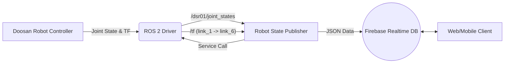

# Robo-P-tissier
# 🤖 Robot State Publisher (Firebase Sync)

이 프로젝트는 ROS 2 환경에서 **Doosan Robot**의 실시간 상태 정보(Joint, TCP Pose, System State)를 수집하고, 이를 **Firebase Realtime Database**에 동기화하여 웹 또는 모바일 클라이언트에서 로봇의 상태를 원격으로 모니터링할 수 있도록 지원하는 노드입니다.

## 📌 주요 기능 (Key Features)

* **실시간 데이터 동기화**: 5Hz(0.2초) 주기로 로봇의 상태 정보를 Firebase에 업로드합니다.
* **좌표계 변환 (TF Listener)**: `link_1`(Base)과 `link_6`(TCP) 사이의 TF를 조회하여 TCP의 위치(x, y, z)와 자세(Roll, Pitch, Yaw)를 계산합니다.
* **단위 변환 자동화**: 로봇 내부의 Radian 값을 직관적인 Degree 값으로 자동 변환하여 저장합니다.
* **시스템 상태 모니터링**: 로봇 컨트롤러의 상태(Standby, Moving, E-Stop 등)를 감지하고 텍스트로 변환하여 제공합니다.
* **로컬 토픽 발행**: 상태 변경 시에만 로컬 ROS 토픽을 발행하여 네트워크 부하를 최적화합니다.

## 🛠️ 시스템 아키텍처 (System Architecture)



## 📋 사전 요구 사항 (Prerequisites)

이 노드를 실행하기 위해 다음 환경과 패키지가 필요합니다.

* **OS**: Ubuntu 22.04 (Recommended)
* **ROS 2**: Humble Hawksbill
* **Language**: Python 3.10+
* **Python Dependencies**:
```bash
  pip install firebase-admin
```
