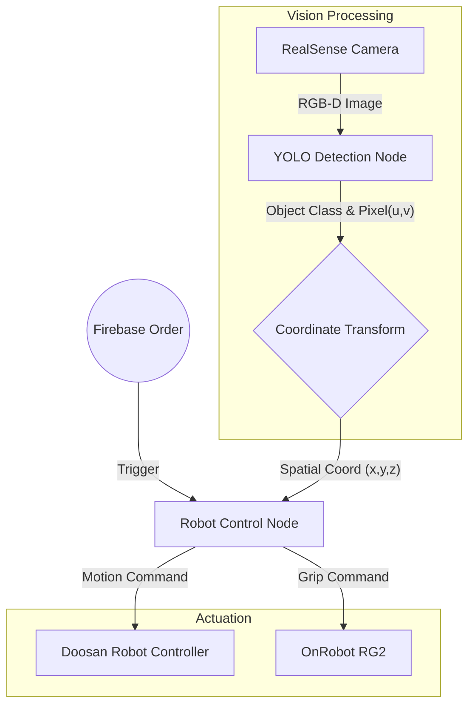

# 🦾 Autonomous Pick & Place System with Vision AI
> **Deep Learning(YOLOv8) 기반의 객체 인식과 Depth Sensing을 활용한 두산 로봇 자율 파지(Grasping) 시스템입니다.**

## 📖 Project Overview
이 프로젝트는 **RealSense D435i** 카메라로 작업 공간을 스캔하여 목표 물체를 인식하고, **Doosan Robotics (M-Series)** 로봇 팔을 제어하여 물체를 집어 올리는(Pick) 시스템의 제어 로직을 담고 있습니다.
Firebase를 통해 주문(Order)이 들어오면, 로봇은 대기 상태에서 벗어나 YOLO 모델이 탐지한 좌표로 이동하여 작업을 수행합니다.

---

## 🛠 Tech Stack

### Hardware
  

### Software & Libraries
   

---

## 🏗️ System Architecture

전체 시스템은 **Vision Node**와 **Control Node**가 토픽 통신을 주고받으며 협업하는 구조입니다.

