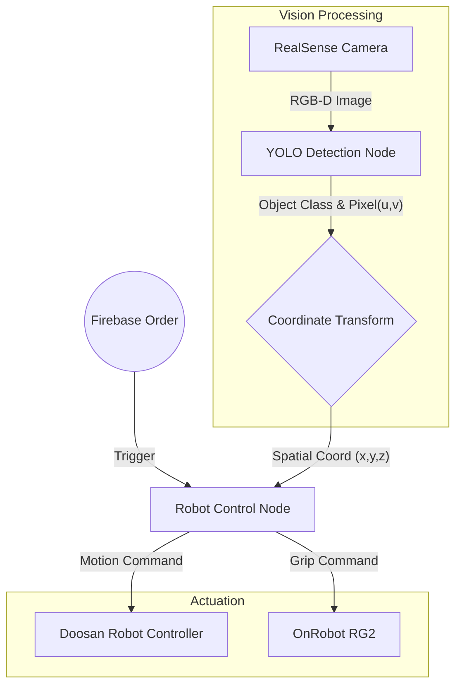
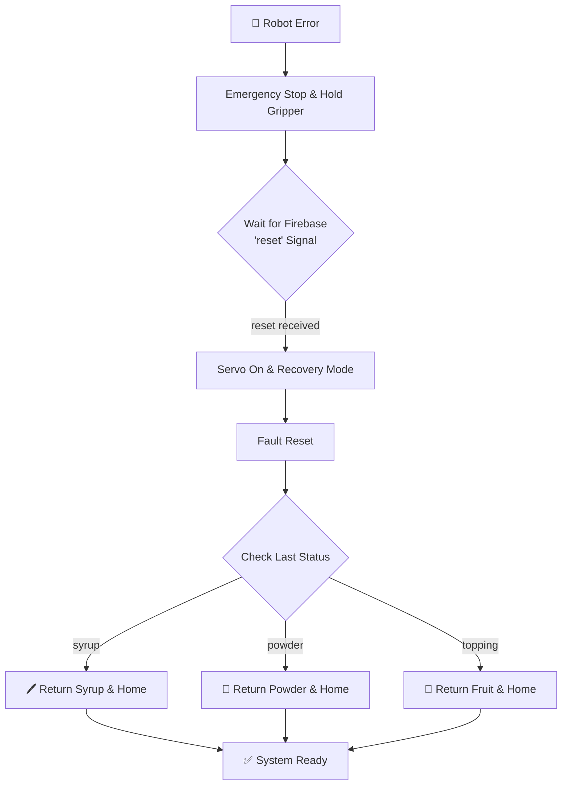

# 🦾 Autonomous Pick & Place System with Vision AI
> **Deep Learning(YOLOv8) 기반의 객체 인식과 Depth Sensing을 활용한 두산 로봇 자율 파지(Grasping) 시스템입니다.**

## 📖 Project Overview
이 프로젝트는 **RealSense D435i** 카메라로 작업 공간을 스캔하여 목표 물체를 인식하고, **Doosan Robotics (M-Series)** 로봇 팔을 제어하여 물체를 집어 올리는(Pick) 시스템의 제어 로직을 담고 있습니다.
Firebase를 통해 주문(Order)이 들어오면, 로봇은 대기 상태에서 벗어나 YOLO 모델이 탐지한 좌표로 이동하여 작업을 수행합니다.

---

## 🛠 Tech Stack

### Hardware
  

### Software & Libraries
   

---

## 🏗️ System Architecture

전체 시스템은 **Vision Node**와 **Control Node**가 토픽 통신을 주고받으며 협업하는 구조입니다.


## 🕹️ Robot Operation Logic
이 시스템은 Firebase 주문 데이터를 기반으로 4가지 핵심 공정을 순차적으로 수행합니다. 각 공정은 독립적인 함수로 모듈화되어 있으며, `check_safety()` 훅을 통해 실시간으로 안전을 검증합니다.

| Process | Function | Description |
| :--- | :--- | :--- |
| **1. Drawing** | `execute_custom_design` | 사용자가 그린 좌표 데이터(Stroke)를 파싱하여 케이크 위에 시럽으로 드로잉합니다. (Spline 보간 적용) |
| **2. Powder** | `execute_powder` | 파우더 통을 파지한 후, `move_periodic` 함수를 사용해 주기적인 흔들기 동작을 수행합니다. |
| **3. Topping** | `execute_toppings_process` | YOLO Vision 데이터를 기반으로 과일의 좌표를 변환($T_{cam \to robot}$)하여 Pick & Place를 수행합니다. |
| **4. Pickup** | `execute_cake_pickup` | 완성된 케이크를 컨베이어 벨트나 픽업 존으로 안전하게 이송합니다. |

---

## 🛡️ Safety & Error Monitoring System
로봇이 동작하는 동안 **별도의 스레드(Thread)**가 100ms(10Hz) 주기로 로봇의 하드웨어 상태를 감시합니다. 에러가 감지되면 즉시 작업을 중단하고 안전 모드로 진입합니다.

### 1. Real-time State Monitoring (`RobotStateMonitor`)
메인 로직과 분리된 스레드에서 실행되며, 로봇 컨트롤러의 상태 코드를 실시간으로 조회합니다.
* **Normal States**: `STANDBY(1)`, `MOVING(2)`
* **Error States**: `EMERGENCY_STOP(6)`, `SAFE_STOP(5)`, `SERVO_OFF(3)`

### 2. Immediate Safety Action (`check_safety`)
에러 감지 시, 작업 중이던 도구가 낙하하거나 시럽이 흐르지 않도록 즉각적인 조치를 취합니다.
```python
# robot_control_real.py

if current_status == "syrup":
    gripper.move_gripper(780) # 시럽 밸브 잠금 (흘림 방지)
elif current_status == "topping_pick":
    gripper.move_gripper(200) # 현재 파지력 유지 (낙하 방지)
```

## 🔄 Smart Recovery & Cleanup System
단순히 로봇을 재부팅하는 것이 아니라, **"어떤 작업을 하다가 멈췄는가?"**를 기억하고 상황에 맞는 **후처리(Cleanup)** 동작을 자동으로 수행합니다.

### 1. Recovery Workflow



### 2. Context-aware Cleanup (상황별 후처리)
로봇이 복구된 후, 작업 중이던 도구를 안전한 위치로 반납하는 자동화 로직입니다.

 🖊️ Case 1: 시럽 작업 중 중단 (`execute_post_recovery_motion`)
* 동작: 현재 위치에서 안전 높이까지 상승 → 시럽 디스펜서 거치대 이동 → 그리퍼 Open → 홈 복귀.

* 목적: 드로잉 중 멈췄을 때 케이크를 망가뜨리지 않고 빠져나옴.

 🧂 Case 2: 파우더 작업 중 중단 (`execute_powder_recovery`)
* 동작: 흔들기 동작 중단 → 파우더 통 거치대 좌표로 접근 → 서서히 하강 → 그리퍼 Open → 홈 복귀.

* 목적: 무거운 파우더 통을 들고 있는 상태를 해제하여 로봇 부하 방지.

 🍓 Case 3: 토핑 작업 중 중단 (`execute_topping_recovery`)
* 동작: g_last_topping_source 변수에 저장된 **"집었던 위치"**를 역추적 → 해당 위치로 이동하여 토핑 반납 → 홈 복귀.

* 목적: 집어 올린 과일을 아무데나 버리지 않고 원래 있던 트레이에 다시 놓음.

<div align="center">
  <h3>🎥 Safety Recovery Demo</h3>
  <a href="https://youtu.be/oDFdCd45tNg">
    
  </a>
  <p>👆 이미지를 클릭하면 시연 영상을 볼 수 있습니다.</p>
</div>

### 3. Usage (`Recovery Trigger`)
작업자가 안전을 확인한 후 Firebase 콘솔이나 관리자 앱에서 명령을 전송합니다.

* Firebase Path: /robot_reset

* Value: "reset"

* Result: 로봇이 자동으로 에러를 소거하고, 도구를 반납한 뒤 초기 위치로 돌아옵니다.

## ⚙️ Core Modules

### 1. Object Detection (`yolo.py`)
YOLOv8 모델(best(2).pt)을 로드하여 실시간으로 물체를 탐지합니다.

**RGB Image** : 객체 분류(Classifiction) 및 Bounding Box 추출.

**Depth Image** : 탐지된 객체 중심점의 실제 거리(Depth, mm) 추출.

**Mapping** : class_name_object.json을 참조하여 Class ID를 사람이 읽을 수 있는 이름으로 매핑.

### 2. Main Controller (`robot_control_real.py`)
로봇의 전체 State Machine을 관리하는 메인 노드입니다.

**Firebase Listener** : 주문 대기열을 모니터링하다가 주문 발생 시 작업 시작.

**Coordinate Transformation** : 카메라 좌표계(Camera Frame)의 데이터를 로봇 베이스 좌표계(Robot Base Frame)로 변환.

**Motion Planning** : `dsr_msgs2`를 사용하여 `MoveL`(직선 이동), `MoveJ`(관절 이동) 명령 수행.

### 3. Hand-Eye Calibration
카메라에서 인식한 좌표를 로봇이 이해하는 좌표로 변환하기 위해 변환 행렬(`T_gripper2camera.npy`)을 적용합니다.

$$P_{robot} = T_{base \to cam} \cdot P_{cam}$$ 

Note: `T_gripper2camera.npy` 파일에는 사전에 계산된 4x4 Homogeneous Transformation Matrix가 저장되어 있습니다.

## 📡 Topic & Service Interface

이 패키지 내에서 노드 간 통신에 사용되는 주요 인터페이스 명세입니다.

| Type | Name | Description | Message Type |
| :--- | :--- | :--- | :--- |
| **Subscribe** | `/camera/color/image_raw` | RealSense RGB 스트림 | `sensor_msgs/Image` |
| **Subscribe** | `/camera/aligned_depth_to_color/image_raw` | RGB에 정렬된 Depth 스트림 | `sensor_msgs/Image` |
| **Publish** | `/yolo_object_topic` | 탐지된 객체의 좌표 및 클래스 정보 | `Custom Interface` |
| **Service** | `/onrobot/rg2/ctrl` | 그리퍼 Open/Close 제어 | `std_srvs/Trigger` |
| **Action** | `/dsr01/motion/move_joint` | 로봇 관절 이동 명령 | `dsr_msgs2/MoveJoint` |

## 🚀 How to Run

### 1. Hardware Setup
- Doosan Robot과 제어 PC가 이더넷으로 연결되어 있어야 합니다.
- RealSense 카메라가 USB 3.0 포트에 연결되어 있어야 합니다.
- OnRobot 그리퍼가 Modbus/TCP 또는 Compute Box를 통해 연결되어 있어야 합니다.

### 2. Launch Steps

**Step 1: Vision Detection 노드 실행**
YOLO 객체 인식 및 Depth 측정을 수행하는 노드를 실행합니다.

```bash
ros2 run robot_control detection
```

**Step 2: Robot Control 실행**
주문을 수신하고 로봇을 움직이는 메인 컨트롤러를 실행합니다.

```bash
ros2 run robot_control robot_control_real
```

## 📂 File Structure
<pre>
📦 robot_control_pkg
 ┣ 📜 robot_control_real.py  # 메인 로봇 제어 노드
 ┣ 📜 yolo.py                # YOLOv8 객체 인식
 ┣ 📜 realsense.py           # RealSense 설정
 ┣ 📜 onrobot.py             # 그리퍼 제어
 ┣ 💾 best(2).pt             # YOLO 가중치 파일
 ┗ ⚙️ class_name_object.json # 클래스 매핑 정보
</pre>
