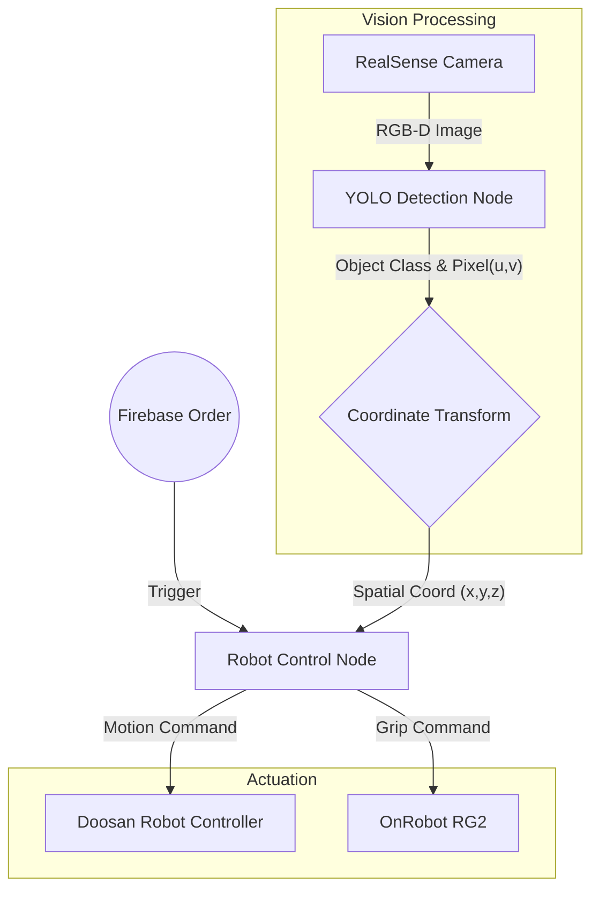

# 🦾 Autonomous Pick & Place System with Vision AI
> **Deep Learning(YOLOv8) 기반의 객체 인식과 Depth Sensing을 활용한 두산 로봇 자율 파지(Grasping) 시스템입니다.**

## 📖 Project Overview
이 프로젝트는 **RealSense D435i** 카메라로 작업 공간을 스캔하여 목표 물체를 인식하고, **Doosan Robotics (M-Series)** 로봇 팔을 제어하여 물체를 집어 올리는(Pick) 시스템의 제어 로직을 담고 있습니다.
Firebase를 통해 주문(Order)이 들어오면, 로봇은 대기 상태에서 벗어나 YOLO 모델이 탐지한 좌표로 이동하여 작업을 수행합니다.

---

## 🛠 Tech Stack

### Hardware
  

### Software & Libraries
   

---

## 🏗️ System Architecture

전체 시스템은 **Vision Node**와 **Control Node**가 토픽 통신을 주고받으며 협업하는 구조입니다.

## ⚙️ Core Modules

### 1. Object Detection (`yolo.py`)
YOLOv8 모델(best(2).pt)을 로드하여 실시간으로 물체를 탐지합니다.

**RGB Image** : 객체 분류(Classifiction) 및 Bounding Box 추출.

**Depth Image** : 탐지된 객체 중심점의 실제 거리(Depth, mm) 추출.

**Mapping** : class_name_object.json을 참조하여 Class ID를 사람이 읽을 수 있는 이름으로 매핑.

### 2. Main Controller (`robot_control_real.py`)
로봇의 전체 State Machine을 관리하는 메인 노드입니다.

**Firebase Listener** : 주문 대기열을 모니터링하다가 주문 발생 시 작업 시작.

**Coordinate Transformation** : 카메라 좌표계(Camera Frame)의 데이터를 로봇 베이스 좌표계(Robot Base Frame)로 변환.

**Motion Planning** : `dsr_msgs2`를 사용하여 `MoveL`(직선 이동), `MoveJ`(관절 이동) 명령 수행.

### 3. Hand-Eye Calibration
카메라에서 인식한 좌표를 로봇이 이해하는 좌표로 변환하기 위해 변환 행렬(`T_gripper2camera.npy`)을 적용합니다.

$$P_{robot} = T_{base \to cam} \cdot P_{cam}$$ 

Note: `T_gripper2camera.npy` 파일에는 사전에 계산된 4x4 Homogeneous Transformation Matrix가 저장되어 있습니다.

## 📡 Topic & Service Interface

이 패키지 내에서 노드 간 통신에 사용되는 주요 인터페이스 명세입니다.

| Type | Name | Description | Message Type |
| :--- | :--- | :--- | :--- |
| **Subscribe** | `/camera/color/image_raw` | RealSense RGB 스트림 | `sensor_msgs/Image` |
| **Subscribe** | `/camera/aligned_depth_to_color/image_raw` | RGB에 정렬된 Depth 스트림 | `sensor_msgs/Image` |
| **Publish** | `/yolo_object_topic` | 탐지된 객체의 좌표 및 클래스 정보 | `Custom Interface` |
| **Service** | `/onrobot/rg2/ctrl` | 그리퍼 Open/Close 제어 | `std_srvs/Trigger` |
| **Action** | `/dsr01/motion/move_joint` | 로봇 관절 이동 명령 | `dsr_msgs2/MoveJoint` |
