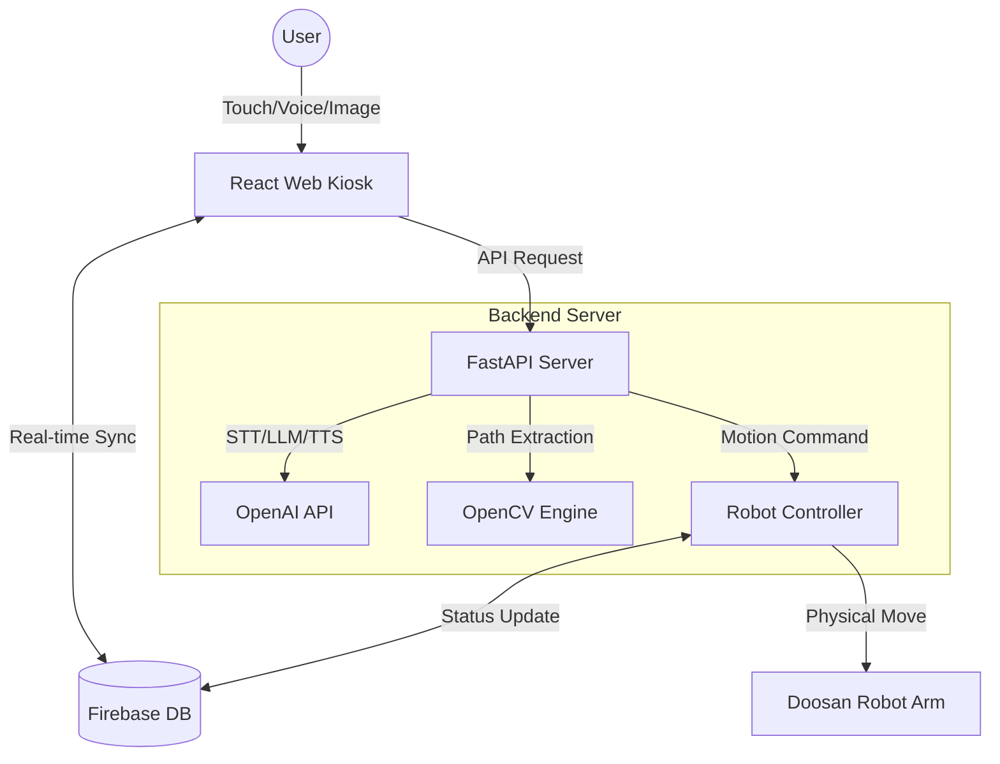

# 🍰 Robo-P-tissier : AI Robot Bakery Kiosk
> **사용자의 목소리와 커스텀 그림을 그려주는 AI 로봇 파티시에 키오스크 시스템**


## 📖 프로젝트 개요 (Project Overview)
**Robo-P-tissier**는 사용자가 웹 키오스크를 통해 케이크를 주문하면, **두산 로보틱스(Doosan Robotics)** 의 로봇 팔이 실제 케이크 위에 데코레이션을 수행하는 통합 자동화 시스템입니다.

단순한 터치 주문을 넘어, **생성형 AI(Voice, Image)** 기술을 도입하여 다음과 같은 혁신적인 경험을 제공합니다.
1.  **AI 음성 상담:** 사용자가 마치 점원과 상담하듯이 OPEN AI의 Whisper를 사용하여 AI가 음성상담 및 음성으로 주문을 도와줍니다.
2.  **커스텀 도안:** 사용자가 그린 그림이나 사진을 분석해 로봇이 그대로 케이크 위에 그려줍니다.
3.  **3D 시각화:** 주문한 케이크의 모습을 3D로 미리 확인합니다.
4.  **실시간 모니터링:** 로봇의 작업 현황과 매장 매출을 관리자가 실시간으로 확인합니다.

---

## 🛠 기술 스택 (Tech Stack)

### 🎨 Frontend (Web Kiosk)
사용자 인터페이스 및 3D 시각화, 관리자 대시보드


* **Core:** React (Vite), React Router
* **Styling:** Tailwind CSS
* **3D Graphics:** React Three Fiber (R3F), Drei
* **Database Sync:** Firebase Realtime Database

### 🧠 Backend & Robot Control
AI 처리, 이미지 비전 분석, 로봇 팔 제어 서버


* **Framework:** FastAPI (Python)
* **AI Models:** OpenAI GPT-4o (Intent Recog), Whisper (STT), Polinations.ai (Image Gen), TTS
* **Computer Vision:** OpenCV (Canny Edge Detection, Path Finding)
* **Robot Interface:** Doosan Robotics DRFL API

---

## 🏗 시스템 아키텍처 (System Architecture)


✨ 주요 기능 (Key Features)
1. 🎤 AI 음성 주문 상담 (Voice Counselor)
사용자의 음성을 녹음하여 Whisper 모델로 텍스트 변환

GPT-4o가 주문 맥락(토핑, 사이즈, 시럽 등)을 파악하여 JSON 데이터 추출

AI 사장님 목소리로 실시간 음성 응답 제공

2. 📸 커스텀 도안 및 이미지 생성 (Custom Design)
이미지 업로드: 사용자가 사진을 올리면 OpenCV가 윤곽선을 추출하여 로봇 경로(G-code 유사 좌표)로 변환

AI 생성: "산타 모자를 쓴 고양이 그려줘"라고 입력하면 DALL-E 3가 도안을 생성하고 즉시 적용

3. 🎂 3D 실시간 미리보기 (Interactive 3D View)
Three.js를 활용하여 선택한 시럽, 토핑, 파우더가 적용된 케이크를 웹에서 360도로 확인

로봇 팔의 움직임과 크리스마스 테마 배경(눈 내리는 효과) 렌더링

4. 📹 케이크 제작 타임랩스 (Auto Timelapse)
로봇이 케이크를 만드는 모든 과정을 카메라가 자동으로 녹화.

작업이 완료되면 **배속 영상(Timelapse)**으로 자동 변환되어 고객에게 제공.

소중한 추억을 QR 코드나 앱을 통해 다운로드 가능.

<div style="flex: 1; text-align: center;">
    
    <br>
    <span style="font-size: 11px; color: gray;">Scan to View Demo</span>
</div>

***위 QR을 실제로 찍어보세요 케이크 제작과정을 보실 수 있습니다***

5. 🤖 로봇 제어 및 안전 시스템 (Robot Control)
주문 대기열(Queue) 관리 및 비동기 작업 처리

좌표 변환: 이미지 픽셀 좌표(Pixel) → 로봇 물리 좌표(mm) 자동 보정

안전 감지: 로봇 에러 발생 시 프론트엔드에 Emergency Modal 즉시 팝업 및 작업 중단


## 📂 폴더 구조 (Project Structure)

```bash
ROKEY-SYSTEM/
├── frontend/                 # React Vite Project (Web Kiosk)
│   ├── src/
│   │   ├── App.jsx           # 메인 실행 컴포넌트 (주문, 3D 뷰어, 상태 관리 총괄)
│   │   ├── LandingPage.jsx   # 크리스마스 테마의 3D 인터랙티브 대기화면
│   │   ├── Admin.jsx         # 관리자 대시보드 (매출 통계, 공정률 모니터링)
│   │   ├── PhotoUploader.jsx # 커스텀 도안 업로드, 경로 분석 및 편집 도구
│   │   ├── PaymentModal.jsx  # 결제 수단 선택 및 픽업용 전화번호 입력 팝업
│   │   ├── OrderSuccessModal.jsx # 결제 완료 후 주문 번호 및 대기시간 안내 팝업
│   │   └── Popup.jsx         # 픽업 방식(매장/포장) 및 시간 설정 팝업
│   └── ...
├── backend/                  # FastAPI Project (AI & Robot Control)
│   ├── main.py               # API Gateway & Endpoints (서버 진입점)
│   ├── robot_server.py       # Robot Controller (두산 로봇 제어 및 작업 큐 관리)
│   ├── cv_utils.py           # Image Processing (OpenCV 기반 윤곽선/좌표 추출)
│   ├── image_cv.py           # Vision Utilities (비전 처리 보조 모듈)
│   ├── approach_voice.py     # Auto Greeting (고객 접근 감지 및 음성 인사)
│   ├── camera_manager.py     # Webcam Manager (카메라 리소스 및 연결 관리)
│   ├── order_monitor.py      # Order Listener (Firebase 실시간 주문 감지)
│   └── ...
└── README.md
```


