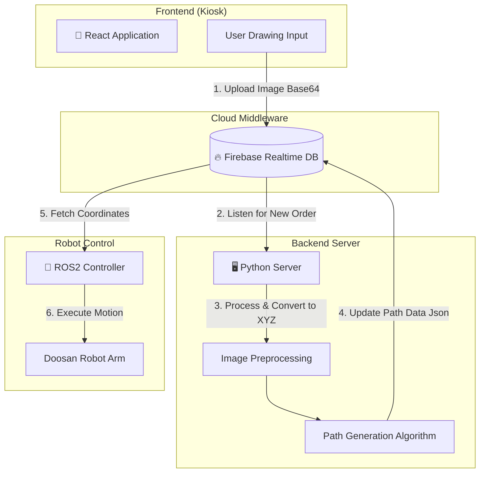
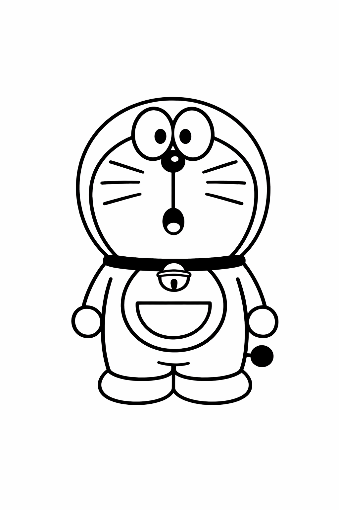
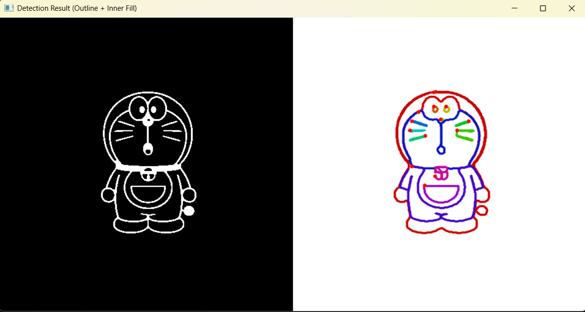
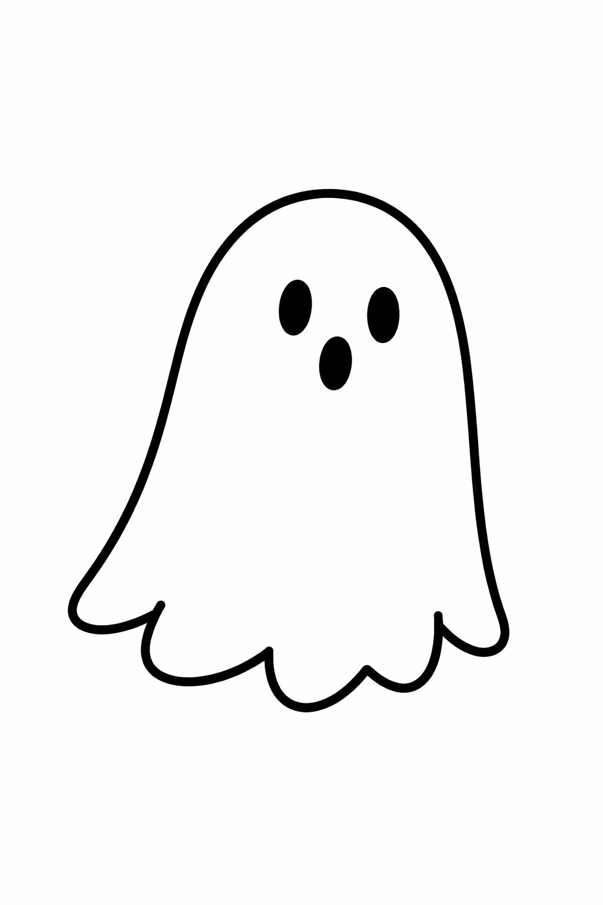
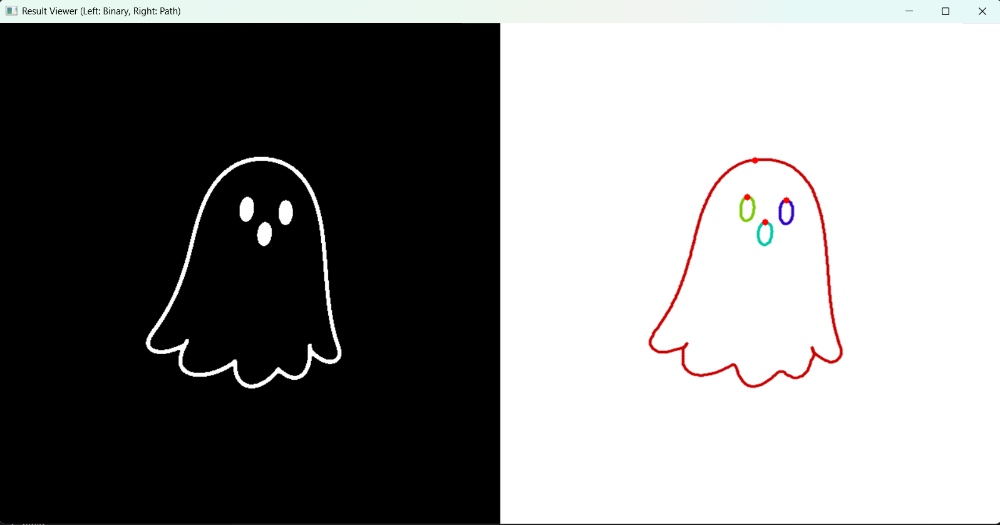
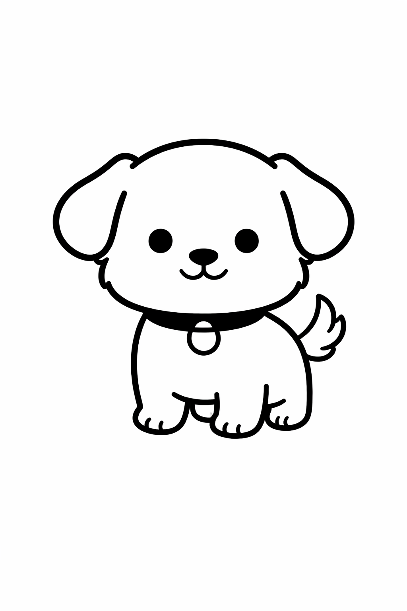
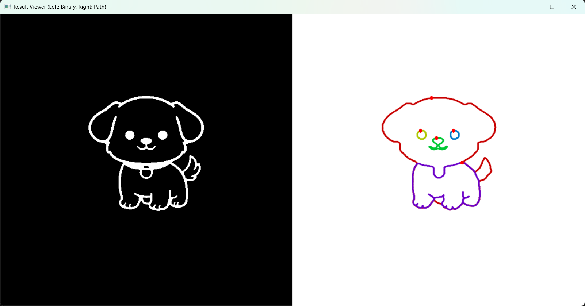
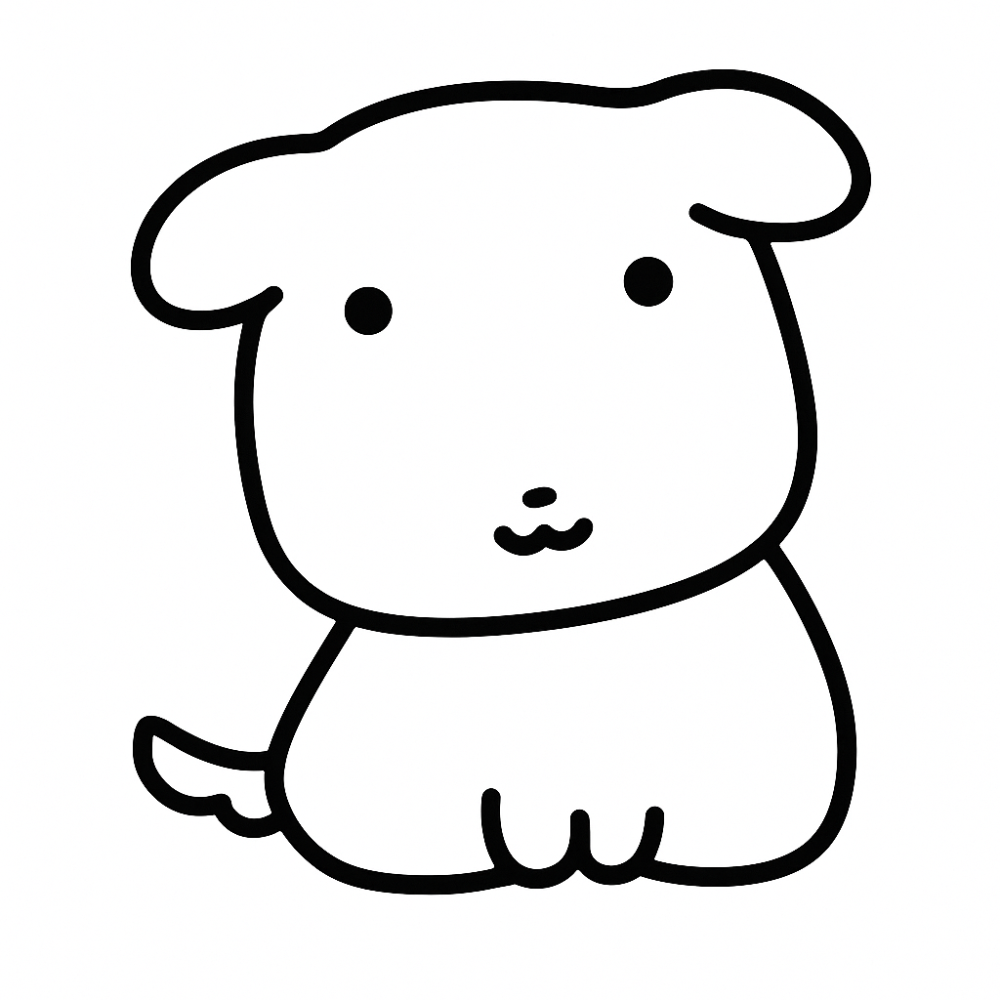
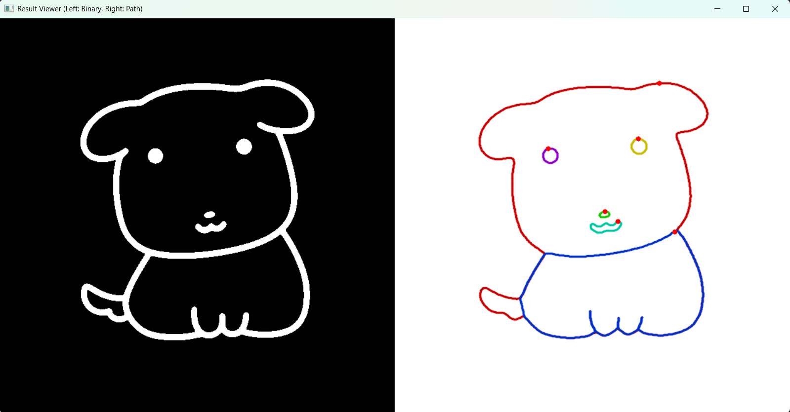

# 🍰 Robo-Patissier: Image Processing & Path Generation
> **사용자가 그린 그림을 로봇 팔이 이해할 수 있는 좌표 경로(Trajectory)로 변환하는 핵심 이미지 처리 모듈입니다.**

## 📖 Project Overview
이 프로젝트는 키오스크에서 사용자가 직접 그린 '커스텀 케이크 도안'을 로봇 팔(Doosan Robotics)이 실제 케이크 위에 시럽으로 그려주는 시스템의 **Vision Processing** 파트입니다. 
입력된 비정형 이미지 데이터를 분석하여, 로봇의 End-Effector가 추종할 수 있는 최적의 **Vector Path(G-Code 유사 형태)**를 생성합니다.

---

## 🛠 Tech Stack
### Languages & Libraries
  

### Core Algorithms
- **Image Processing**: Grayscale, Binarization (Otsu's Thresholding), Skeletonization
- **Path Planning**: Contour Extraction, Douglas-Peucker Algorithm (Simplification), Linear Interpolation
- **Coordinate Transformation**: Pixel-to-Robot Frame Mapping (Homogeneous Transformation)

---
## 🏗️ System Architecture
본 프로젝트는 **Firebase Realtime Database**를 중앙 허브(Middleware)로 사용하여, 세 개의 독립적인 시스템이 비동기적으로 통신하는 구조입니다.


---
## ⚙️ Processing Pipeline
이미지가 로봇 좌표로 변환되기까지의 5단계 파이프라인입니다.

### 1. Preprocessing (전처리)
사용자의 드로잉 이미지를 로봇 작업 영역(케이크 크기)에 맞게 정규화합니다.
- **Grayscale Conversion**: 3채널(RGB) 이미지를 단일 채널로 변환하여 연산량 감소.
- **Resize & Padding**: 원본 비율을 유지하며 작업 영역(`TARGET_SIZE`)에 맞춰 리사이징 및 여백 추가.
- **Binarization**: Otsu 알고리즘을 적용하여 배경 노이즈를 제거하고 명확한 흑백 이미지 생성.

### 2. Path Extraction (경로 추출)
단순한 외곽선 검출뿐만 아니라, 선의 두께를 보정하여 '획(Stroke)' 중심을 추출합니다.
- **Skeletonization (세선화)**: 두꺼운 펜으로 그려진 선을 1픽셀 두께의 뼈대(Skeleton)로 변환하여 로봇의 이동 경로를 명확히 함.
- **Contour Finding**: `cv2.findContours`를 사용하여 연결된 점들의 집합을 추출.

### 3. Path Optimization (경로 최적화)
로봇의 떨림 방지와 부드러운 주행을 위해 경로를 다듬습니다.
- **Resampling**: 불규칙한 점 간격을 일정한 거리(예: 2.0 pixel)로 재배치하여 속도 프로파일을 균일하게 유지.
- **Smoothing**: 이동 평균 필터(Moving Average) 등을 적용하여 급격한 꺾임 현상 완화.
- **Douglas-Peucker Algorithm**: `cv2.approxPolyDP`를 활용해 불필요한 점을 제거하고 데이터 양 경량화.

### 4. Smart Connection (지능형 연결)
- 끊어진 선들이 일정 거리(`max_gap`) 이내일 경우, 최단 거리 알고리즘을 통해 자동으로 하나의 획으로 연결합니다.
- 불필요한 공중 이동(Air-move)을 최소화하기 위해 경로의 시작점과 끝점을 분석하여 **최적 방문 순서(TSP 유사)**를 결정합니다.

### 5. Coordinate Transformation (좌표 변환)
이미지 좌표계(Pixel)를 로봇 베이스 좌표계(Robot Base Frame, mm)로 매핑합니다.
<p align="center">
  
</p>
- **Origin Shift**: 이미지 좌상단(0,0) → 이미지 중심($c_x, c_y$)으로 원점 이동.
- **Scale ($s$)**: Pixel 단위 → mm 단위 변환 (실제 케이크 지름 기반).
- **Axis Flip**: 이미지 Y축(아래쪽 증가) → 로봇 Y축(위쪽 증가) 반전.

---

## 💻 Code Snippet (Example)

```python
import cv2
import numpy as np

def transform_to_robot_coords(contours, img_size, real_size_mm):
    """
    이미지 윤곽선을 로봇 좌표(mm)로 변환하는 핵심 로직
    """
    robot_paths = []
    scale_factor = real_size_mm / img_size
    cx, cy = img_size / 2, img_size / 2  # 중심점

    for path in contours:
        # 1. 중심 원점 이동
        pts_centered = path - [cx, cy]
        
        # 2. 스케일링 (Pixel -> mm)
        pts_mm = pts_centered * scale_factor
        
        # 3. Y축 반전 (이미지 좌표계 -> 로봇 좌표계)
        pts_mm[:, 1] *= -1 
        
        robot_paths.append(pts_mm)
        
    return robot_paths

```
---

## 📊 Result Visualization
실제 알고리즘 구동 결과입니다. 사용자의 드로잉(Input)을 분석하여, 로봇이 끊김 없이 주행할 수 있는 최적의 경로(Vector Path)로 변환합니다.

| Case | Input Image (Raw) | Processed Path (Vectorized) |
|:---:|:---:|:---:|
| **Case 1<br>(Complex)** |  |  |
| **Case 2<br>(Simple)** |  |  |
| **Case 3<br>(Simple)** |  |  |
| **Case 4<br>(Simple)** |  |  |

> **Case 1 (Doraemon)**: 복잡한 캐릭터의 곡선과 세밀한 특징을 보존하며 경로 생성 <br>
> **Case 2 (Ghost)**: 단순한 외곽선의 끊어진 부분을 자동으로 연결(Smart Connection)하여 처리

### 💾 Generated Data Structure (Firebase)
최종 변환된 경로 데이터는 Firebase Realtime Database의 `drawing_path` 필드에 업로드되어 로봇과 동기화됩니다.


> **drawing_path**: 이미지에서 추출된 좌표들이 `[{x: mm, y: mm}, ...]` 형태의 JSON 배열로 변환되어 저장됩니다. 로봇은 이 좌표를 순차적으로 구독하여 작업을 수행합니다.

---

## 🎥 Demo Video
프로젝트 시연 영상입니다. 이미지를 클릭하면 YouTube 영상으로 이동합니다.

<div align="center">
  <a href="https://youtu.be/Dj4nwtkIFmw">
    
  </a>
</div>

<br>

> **Note**: 타임랩스로 촬영된 영상입니다. 
